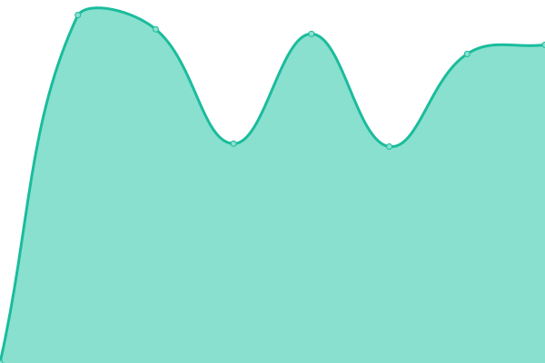

# [📈 Live Status](https://status.interzone.network): <!--live status--> **🟧 Partial outage**

This repository contains the open-source uptime monitor and status page for [Constructions Incongrues](https://constructions-incongrues.net), powered by [Upptime](https://github.com/upptime/upptime).

With [Upptime](https://upptime.js.org), you can get your own unlimited and free uptime monitor and status page, powered entirely by a GitHub repository. We use [Issues](https://github.com/constructions-incongrues/status-interzone/issues) as incident reports, [Actions](https://github.com/constructions-incongrues/status-interzone/actions) as uptime monitors, and [Pages](https://status.interzone.network) for the status page.

<!--start: status pages-->
<!-- This summary is generated by Upptime (https://github.com/upptime/upptime) -->
<!-- Do not edit this manually, your changes will be overwritten -->
<!-- prettier-ignore -->
| URL | Status | History | Response Time | Uptime |
| --- | ------ | ------- | ------------- | ------ |
|  [amandinemeyer.com](https://www.amandinemeyer.com) | 🟩 Up | [amandinemeyer-com.yml](https://github.com/constructions-incongrues/status-interzone/commits/HEAD/history/amandinemeyer-com.yml) | 

 2080ms
     
 | 

<a href="https://status.interzone.network/history/amandinemeyer-com">99.29%</a>
    

|  [arrachetoiunoeil.com](https://www.arrachetoiunoeil.com) | 🟩 Up | [arrachetoiunoeil-com.yml](https://github.com/constructions-incongrues/status-interzone/commits/HEAD/history/arrachetoiunoeil-com.yml) | 

 2908ms
     
 | 

<a href="https://status.interzone.network/history/arrachetoiunoeil-com">99.67%</a>
    

|  [brkcore.fr](https://www.brkcore.fr) | 🟩 Up | [brkcore-fr.yml](https://github.com/constructions-incongrues/status-interzone/commits/HEAD/history/brkcore-fr.yml) | 

 2289ms
     
 | 

<a href="https://status.interzone.network/history/brkcore-fr">99.75%</a>
    

|  [chipndamned.com](https://www.chipndamned.com) | 🟩 Up | [chipndamned-com.yml](https://github.com/constructions-incongrues/status-interzone/commits/HEAD/history/chipndamned-com.yml) | 

 592ms
     
 | 

<a href="https://status.interzone.network/history/chipndamned-com">99.44%</a>
    

|  [collectionrevue.com](https://www.collectionrevue.com) | 🟩 Up | [collectionrevue-com.yml](https://github.com/constructions-incongrues/status-interzone/commits/HEAD/history/collectionrevue-com.yml) | 

 1013ms
     
 | 

<a href="https://status.interzone.network/history/collectionrevue-com">99.41%</a>
    

|  [darlingdada.com](https://www.darlingdada.com) | 🟥 Down | [darlingdada-com.yml](https://github.com/constructions-incongrues/status-interzone/commits/HEAD/history/darlingdada-com.yml) | 

 0ms
     
 | 

<a href="https://status.interzone.network/history/darlingdada-com">0.00%</a>
    

|  [degelite.org](https://www.degelite.org) | 🟩 Up | [degelite-org.yml](https://github.com/constructions-incongrues/status-interzone/commits/HEAD/history/degelite-org.yml) | 

 1156ms
     
 | 

<a href="https://status.interzone.network/history/degelite-org">99.44%</a>
    

|  [elisekobischmiana.com](https://www.elisekobischmiana.com) | 🟥 Down | [elisekobischmiana-com.yml](https://github.com/constructions-incongrues/status-interzone/commits/HEAD/history/elisekobischmiana-com.yml) | 

 730ms
     
 | 

<a href="https://status.interzone.network/history/elisekobischmiana-com">98.86%</a>
    

|  [glafouk.com](https://www.glafouk.com) | 🟥 Down | [glafouk-com.yml](https://github.com/constructions-incongrues/status-interzone/commits/HEAD/history/glafouk-com.yml) | 

 0ms
     
 | 

<a href="https://status.interzone.network/history/glafouk-com">0.00%</a>
    

|  [juliadrouhin.com](https://www.juliadrouhin.com) | 🟥 Down | [juliadrouhin-com.yml](https://github.com/constructions-incongrues/status-interzone/commits/HEAD/history/juliadrouhin-com.yml) | 

 540ms
     
 | 

<a href="https://status.interzone.network/history/juliadrouhin-com">98.90%</a>
    

|  [lelaboratoire.be](https://www.lelaboratoire.be) | 🟥 Down | [lelaboratoire-be.yml](https://github.com/constructions-incongrues/status-interzone/commits/HEAD/history/lelaboratoire-be.yml) | 

 0ms
     
 | 

<a href="https://status.interzone.network/history/lelaboratoire-be">0.00%</a>
    

|  [leseditionsduchevet.fr](https://www.leseditionsduchevet.fr) | 🟩 Up | [leseditionsduchevet-fr.yml](https://github.com/constructions-incongrues/status-interzone/commits/HEAD/history/leseditionsduchevet-fr.yml) | 

 686ms
     
 | 

<a href="https://status.interzone.network/history/leseditionsduchevet-fr">99.04%</a>
    

|  [mailleret.fr](https://www.mailleret.fr) | 🟥 Down | [mailleret-fr.yml](https://github.com/constructions-incongrues/status-interzone/commits/HEAD/history/mailleret-fr.yml) | 

 0ms
     
 | 

<a href="https://status.interzone.network/history/mailleret-fr">0.00%</a>
    

|  [moncul.org](https://www.moncul.org) | 🟩 Up | [moncul-org.yml](https://github.com/constructions-incongrues/status-interzone/commits/HEAD/history/moncul-org.yml) | 

 2274ms
     
 | 

<a href="https://status.interzone.network/history/moncul-org">99.60%</a>
    

|  [nulsidecouvert.org](https://www.nulsidecouvert.org) | 🟩 Up | [nulsidecouvert-org.yml](https://github.com/constructions-incongrues/status-interzone/commits/HEAD/history/nulsidecouvert-org.yml) | 

 555ms
     
 | 

<a href="https://status.interzone.network/history/nulsidecouvert-org">98.98%</a>
    

|  [tdm.incongru.org](https://tdm.incongru.org) | 🟩 Up | [tdm-incongru-org.yml](https://github.com/constructions-incongrues/status-interzone/commits/HEAD/history/tdm-incongru-org.yml) | 

 3976ms
     
 | 

<a href="https://status.interzone.network/history/tdm-incongru-org">99.83%</a>
    

|  [violentnarcissus.incongru.org](https://violentnarcissus.incongru.org) | 🟩 Up | [violentnarcissus-incongru-org.yml](https://github.com/constructions-incongrues/status-interzone/commits/HEAD/history/violentnarcissus-incongru-org.yml) | 

 841ms
     
 | 

<a href="https://status.interzone.network/history/violentnarcissus-incongru-org">100.00%</a>
    

<!--end: status pages-->

[**Visit our status website →**](https://status.interzone.network)

## 📄 License

- Powered by: [Upptime](https://github.com/upptime/upptime)
- Code: [MIT](./LICENSE) © [Anand Chowdhary](https://anandchowdhary.com), supported by [Pabio](https://pabio.com)
- Data in the `./history` directory: [Open Database License](https://opendatacommons.org/licenses/odbl/1-0/)
