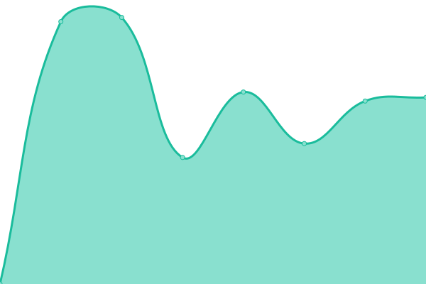

# [📈 Live Status](https://status.interzone.network): <!--live status--> **🟩 All systems operational**

This repository contains the open-source uptime monitor and status page for [Constructions Incongrues](https://constructions-incongrues.net), powered by [Upptime](https://github.com/upptime/upptime).

With [Upptime](https://upptime.js.org), you can get your own unlimited and free uptime monitor and status page, powered entirely by a GitHub repository. We use [Issues](https://github.com/constructions-incongrues/status-interzone/issues) as incident reports, [Actions](https://github.com/constructions-incongrues/status-interzone/actions) as uptime monitors, and [Pages](https://status.interzone.network) for the status page.

<!--start: status pages-->
<!-- This summary is generated by Upptime (https://github.com/upptime/upptime) -->
<!-- Do not edit this manually, your changes will be overwritten -->
<!-- prettier-ignore -->
| URL | Status | History | Response Time | Uptime |
| --- | ------ | ------- | ------------- | ------ |
|  [amandinemeyer.com](https://www.amandinemeyer.com) | 🟩 Up | [amandinemeyer-com.yml](https://github.com/constructions-incongrues/interzone-status/commits/HEAD/history/amandinemeyer-com.yml) | 

 1074ms
     
 | 

<a href="https://status.interzone.network/history/amandinemeyer-com">100.00%</a>
    

|  [arrachetoiunoeil.com](https://www.arrachetoiunoeil.com) | 🟩 Up | [arrachetoiunoeil-com.yml](https://github.com/constructions-incongrues/interzone-status/commits/HEAD/history/arrachetoiunoeil-com.yml) | 

 2813ms
     
 | 

<a href="https://status.interzone.network/history/arrachetoiunoeil-com">100.00%</a>
    

|  [brkcore.fr](https://www.brkcore.fr) | 🟩 Up | [brkcore-fr.yml](https://github.com/constructions-incongrues/interzone-status/commits/HEAD/history/brkcore-fr.yml) | 

 1165ms
     
 | 

<a href="https://status.interzone.network/history/brkcore-fr">100.00%</a>
    

|  [chipndamned.com](https://www.chipndamned.com) | 🟩 Up | [chipndamned-com.yml](https://github.com/constructions-incongrues/interzone-status/commits/HEAD/history/chipndamned-com.yml) | 

 570ms
     
 | 

<a href="https://status.interzone.network/history/chipndamned-com">100.00%</a>
    

|  [collectionrevue.com](https://www.collectionrevue.com) | 🟩 Up | [collectionrevue-com.yml](https://github.com/constructions-incongrues/interzone-status/commits/HEAD/history/collectionrevue-com.yml) | 

 1071ms
     
 | 

<a href="https://status.interzone.network/history/collectionrevue-com">100.00%</a>
    

|  [darlingdada.com](https://www.darlingdada.com) | 🟩 Up | [darlingdada-com.yml](https://github.com/constructions-incongrues/interzone-status/commits/HEAD/history/darlingdada-com.yml) | 

 1745ms
     
 | 

<a href="https://status.interzone.network/history/darlingdada-com">100.00%</a>
    

|  [degelite.org](https://www.degelite.org) | 🟩 Up | [degelite-org.yml](https://github.com/constructions-incongrues/interzone-status/commits/HEAD/history/degelite-org.yml) | 

 1012ms
     
 | 

<a href="https://status.interzone.network/history/degelite-org">100.00%</a>
    

|  [glafouk.com](https://www.glafouk.com) | 🟩 Up | [glafouk-com.yml](https://github.com/constructions-incongrues/interzone-status/commits/HEAD/history/glafouk-com.yml) | 

 574ms
     
 | 

<a href="https://status.interzone.network/history/glafouk-com">100.00%</a>
    

|  [juliadrouhin.com](https://www.juliadrouhin.com) | 🟩 Up | [juliadrouhin-com.yml](https://github.com/constructions-incongrues/interzone-status/commits/HEAD/history/juliadrouhin-com.yml) | 

 584ms
     
 | 

<a href="https://status.interzone.network/history/juliadrouhin-com">100.00%</a>
    

|  [lelaboratoire.be](https://www.lelaboratoire.be) | 🟩 Up | [lelaboratoire-be.yml](https://github.com/constructions-incongrues/interzone-status/commits/HEAD/history/lelaboratoire-be.yml) | 

 764ms
     
 | 

<a href="https://status.interzone.network/history/lelaboratoire-be">100.00%</a>
    

|  [lesbarques.org](https://www.lesbarques.org) | 🟩 Up | [lesbarques-org.yml](https://github.com/constructions-incongrues/interzone-status/commits/HEAD/history/lesbarques-org.yml) | 

 219ms
     
 | 

<a href="https://status.interzone.network/history/lesbarques-org">100.00%</a>
    

|  [leseditionsduchevet.fr](https://www.leseditionsduchevet.fr) | 🟩 Up | [leseditionsduchevet-fr.yml](https://github.com/constructions-incongrues/interzone-status/commits/HEAD/history/leseditionsduchevet-fr.yml) | 

 639ms
     
 | 

<a href="https://status.interzone.network/history/leseditionsduchevet-fr">100.00%</a>
    

|  [lesetoilesflottantes.incongru.org](https://lesetoilesflottantes.incongru.org) | 🟩 Up | [lesetoilesflottantes-incongru-org.yml](https://github.com/constructions-incongrues/interzone-status/commits/HEAD/history/lesetoilesflottantes-incongru-org.yml) | 

 1318ms
     
 | 

<a href="https://status.interzone.network/history/lesetoilesflottantes-incongru-org">100.00%</a>
    

|  [microcontact.incongru.org](https://microcontact.incongru.org) | 🟩 Up | [microcontact-incongru-org.yml](https://github.com/constructions-incongrues/interzone-status/commits/HEAD/history/microcontact-incongru-org.yml) | 

 539ms
     
 | 

<a href="https://status.interzone.network/history/microcontact-incongru-org">100.00%</a>
    

|  [moncul.org](https://www.moncul.org) | 🟩 Up | [moncul-org.yml](https://github.com/constructions-incongrues/interzone-status/commits/HEAD/history/moncul-org.yml) | 

 1780ms
     
 | 

<a href="https://status.interzone.network/history/moncul-org">100.00%</a>
    

|  [nulsidecouvert.org](https://www.nulsidecouvert.org) | 🟩 Up | [nulsidecouvert-org.yml](https://github.com/constructions-incongrues/interzone-status/commits/HEAD/history/nulsidecouvert-org.yml) | 

 558ms
     
 | 

<a href="https://status.interzone.network/history/nulsidecouvert-org">100.00%</a>
    

|  [tdm.incongru.org](https://tdm.incongru.org) | 🟩 Up | [tdm-incongru-org.yml](https://github.com/constructions-incongrues/interzone-status/commits/HEAD/history/tdm-incongru-org.yml) | 

 719ms
     
 | 

<a href="https://status.interzone.network/history/tdm-incongru-org">100.00%</a>
    

|  [violentnarcissus.incongru.org](https://violentnarcissus.incongru.org) | 🟩 Up | [violentnarcissus-incongru-org.yml](https://github.com/constructions-incongrues/interzone-status/commits/HEAD/history/violentnarcissus-incongru-org.yml) | 

 2451ms
     
 | 

<a href="https://status.interzone.network/history/violentnarcissus-incongru-org">100.00%</a>
    

<!--end: status pages-->

[**Visit our status website →**](https://status.interzone.network)

## 📄 License

- Powered by: [Upptime](https://github.com/upptime/upptime)
- Code: [MIT](./LICENSE) © [Anand Chowdhary](https://anandchowdhary.com), supported by [Pabio](https://pabio.com)
- Data in the `./history` directory: [Open Database License](https://opendatacommons.org/licenses/odbl/1-0/)
